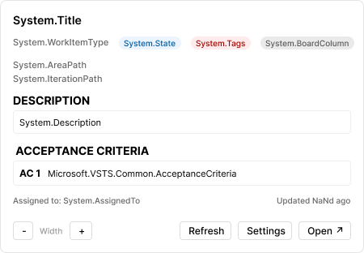

# Azure DevOps PBI Integration for Figma

A powerful **Hybrid Figma Plugin & Widget** that brings Azure DevOps Work Items (PBIs) directly onto your Figma canvas. Keep your design acceptance criteria in sync with your development backlog.



## 🚀 Key Features

*   **Live Data Sync**: Fetches real-time status, acceptance criteria, description, and assignee data from Azure DevOps.
*   **Smart Widget**:
    *   **Resizable**: Adjust width from 280px to 800px directly on canvas.
    *   **Interactive**: Expand/Collapse Acceptance Criteria and Descriptions.
    *   **Configurable**: Toggle visibility of fields (Tags, Area Path, State, etc.).
*   **Secure**: Encrypted PAT storage using AES-GCM encryption and CORS proxy communication.
*   **Persistent Config**: Remembers your Base URL and Settings for fast workflow.

## 🛠 Prerequisites

1.  **Azure DevOps Account**: Access to an Organization and Project.
2.  **Personal Access Token (PAT)**: Requires `Work Items (Read)` scope.
3.  **CORS Proxy**: This widget requires a companion CORS proxy to communicate with Azure DevOps from Figma's environment.

## 📦 Installation

1.  **Install Dependencies**
    ```bash
    npm install
    ```

2.  **Build the Plugin**
    ```bash
    npm run build
    ```
    *This generates the `bundle.js` file.*

3.  **Import to Figma**
    *   Open Figma.
    *   **Plugins > Development > Import plugin from manifest...**
    *   Select `manifest.json`.

## 🔐 Self-Hosted Proxy Setup (Recommended)

**For production use, we strongly recommend deploying your own CORS proxy** to avoid sharing infrastructure and costs.

### Why Self-Host?

- **Cost Control**: Avoid hitting shared proxy rate limits
- **Privacy**: Your Azure DevOps data stays within your infrastructure
- **Reliability**: No dependency on third-party proxy availability
- **Customization**: Modify proxy behavior for your organization's needs

### Deployment Options

The CORS proxy code is maintained in a separate private repository. Contact the maintainer for access or deploy using one of these platforms:

#### Option 1: Cloudflare Workers (Recommended)
```bash
# Clone the proxy repository (contact maintainer for access)
git clone <proxy-repo-url>
cd azure-devops-proxy

# Install Wrangler CLI
npm install -g wrangler

# Deploy to your Cloudflare account
wrangler login
wrangler deploy

# Note the deployed URL (e.g., https://your-proxy.workers.dev)
```

#### Option 2: Vercel Edge Functions
```bash
# Deploy to Vercel
vercel --prod

# Update environment variables in Vercel dashboard
```

#### Option 3: AWS Lambda + API Gateway
See the proxy repository's `aws-deployment.md` for CloudFormation templates.

### After Deployment

1. Update the proxy URL in your plugin configuration
2. Ensure CORS headers allow `https://www.figma.com`
3. Consider adding authentication tokens for additional security
4. Monitor usage and set up alerts for rate limits

## 🎮 How to Use

### 1. Initial Setup (The "Setup" Tab)
Before creating your first widget, configure the connection:

1.  **Organization**: Enter your Azure DevOps organization name (e.g., if your URL is `dev.azure.com/my-design-team`, enter `my-design-team`).
2.  **PAT (Personal Access Token)**: Paste your token here.
    *   *Security*: The PAT is encrypted using AES-GCM before being stored in Figma's client storage. Use a token with **Work Items (Read)** scope only.
3.  **Visible Fields**: Toggle which data points you want to see on the widget (e.g., turn off "Area Path" or "Tags" to save space).
4.  **AC Parsing**: Choose how the widget parses your Acceptance Criteria HTML:
    *   **Power User (Default)**: Smartly splits by `AC1`, `1.`, or new lines.
    *   **Gherkin**: Splits by `Given`, `When`, `Then`.
    *   **Standard**: Simple newline splitting.
5.  Click **Save**.

### 2. Creating a Widget (The "Create" Tab)
Once configured, generating a widget is instant:

1.  **Base URL**: Paste the link to your project's work items (e.g., `https://dev.azure.com/org/project/_workitems/edit/`).
    *   *Tip*: The plugin remembers this URL, so you only paste it once per project.
2.  **PBI Number**: Enter the ID of the work item (e.g., `5432`).
3.  **Populate Widget**: Click the blue button.
    *   *A new widget will appear on your canvas with live data.*

## 🔒 Security

This plugin implements multiple security layers:

### Data Protection
- **Encrypted Storage**: Personal Access Tokens are encrypted using AES-GCM (256-bit) before storage
- **No Plaintext Secrets**: All sensitive data is encrypted at rest
- **Secure Communication**: All API calls use HTTPS with the CORS proxy

### Security Best Practices
- Rotate your Azure DevOps PAT regularly (recommend every 90 days)
- Use tokens with minimal required scopes (`Work Items: Read` only)
- Deploy your own CORS proxy for production use
- Review the [SECURITY.md](SECURITY.md) file for vulnerability reporting

### Automated Security
- CodeQL security scanning on every PR
- Dependency vulnerability audits via Dependabot
- npm audit runs on all pushes
- Weekly security scans via GitHub Actions

## 🤝 Contributing

Contributions are welcome! Please:

1. Fork the repository
2. Create a feature branch (`git checkout -b feature/amazing-feature`)
3. Commit your changes (`git commit -m 'Add amazing feature'`)
4. Push to the branch (`git push origin feature/amazing-feature`)
5. Open a Pull Request

All PRs must pass CI checks (build, test, lint, security scans) before merge.

## 📝 License

This project is licensed under the MIT License. See the [LICENSE](LICENSE) file for details.

## 🐛 Issues & Support

- **Bug Reports**: Open an issue with detailed reproduction steps
- **Security Issues**: See [SECURITY.md](SECURITY.md) for responsible disclosure
- **Feature Requests**: Open an issue with the `enhancement` label
- **Questions**: Start a discussion in the Discussions tab
